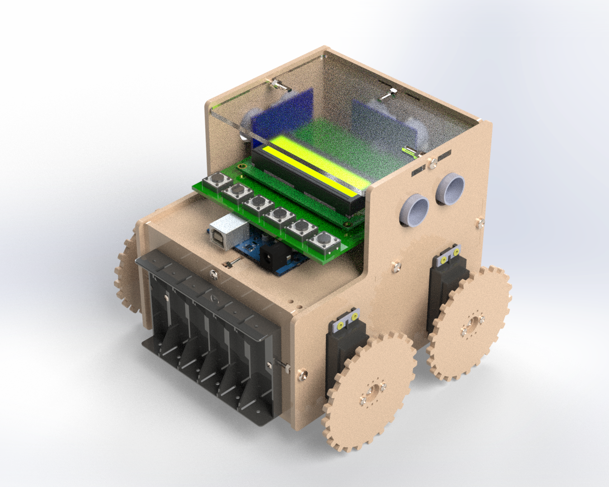

# Low-Cost, Open-Source Robot for Education (LORE)


## Introduction

Welcome to my repository for my Low-Cost, Open-Source Robot for Education (LORE) project.

<div>
    
    
</div>

## Motivation

I started this project because I was approached by the House of Science, a Science, Technology, Engineering, and Mathematics (STEM) organisation in Tauranga, New Zealand, who needed a low-cost, i.e., less than NZD$100.00, platform that could be used to teach robotics.

The problem was: there wasn't anything on the market at met the organisation's needs, so I decided to build one for them.

## Aims

The aims of this project included:
- Developing a low-cost, mobile robot that can be used to teach beginner, intermediate, and advanced students how to program in C++.

## Objectives

The objectives of this project included:
- Creating accessible Computer Aided Design (CAD) files.
- Creating accessible Electronics Design Automation (EDA) files.
- Creating accessible source code and software libraries.
- Creating an easy-to-assemble mobile robot that uses an Arduino microcontroller, servo motors, and ultrasonic sensors.
- Writing clear-to-follow instructions of how to program the mobile robot.

## Repository Structure

The repository is organised as follows:

```console
/lore         
    /cad                          
        /solidworks                    
        /freecad  
        /fabrication
        /renders                     
    /pcb
        /eagle
        /kicad
        /fabrication
    /src
        /beginner
        /intermediate
        /advanced
        /LORE
    /doc                      
        /img
        /costing                
        /programming_guide
```

All CAD files can be found in the `/cad` sub-directory. I've included the original SOLIDWORKS files and the open-source equivalents.

All EDA files can be found in the `/pcb` sub-directory. I've included the original Eagle files and the open-source equivalents.

All source code and software libaries are included in the `/src` sub-directory. The `/LORE` sub-directory is the Arduino library that is used to program the robot.

Documentation is included in the `/doc` sub-directory.

## Tools Used

I used the following tools in this project:
- SOLIDWORKS and FreeCAD.
- Eagle and KiCAD.
- Microsoft Visual Studio and Arduino Integrated Development IDE (IDE).

Get FreeCAD here: https://www.freecadweb.org/.  
Get KiCAD here: https://www.kicad.org/.  
Get Arduino IDE here: https://www.arduino.cc/en/software.  
Get Visual Studio here: https://visualstudio.microsoft.com/.  

Alternatively, you can use Microsoft Visual Studio Code as the IDE.

Get Code here: https://code.visualstudio.com/.

## Credit

Dr Frazer K. Noble  
http://drfknoble.com